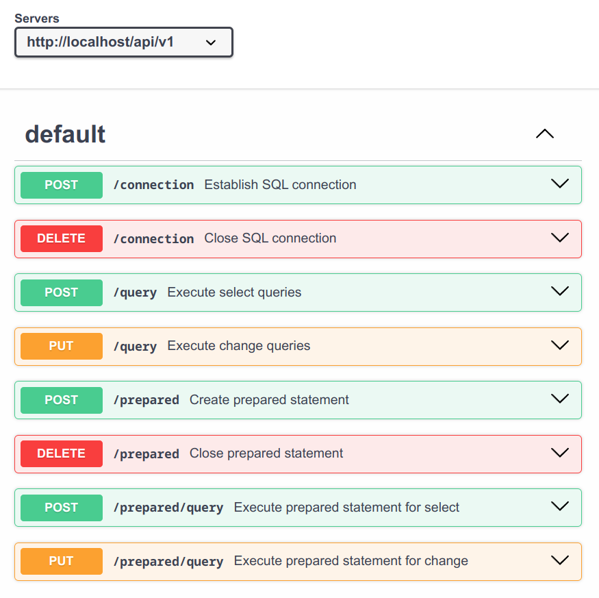

[](https://github.com/alm494/sql_proxy/blob/main/README.md)
[](https://github.com/alm494/sql_proxy/blob/main/README.ru.md)

# SQL-PROXY

## About 

A lightweight REST service designed to replace ADODB calls in legacy software systems that support web requests. This service streamlines database interactions while maintaining security and efficiency.

For example, you can remove all Linux-incompatible components, such as the following items (1C:Enterprise example): 
```1C-Enterprise
Connection = New COMObject("ADODB.Connection");
Connection.Open(ConnectionString);
```
and use web requests in a similar manner instead, using a simple library to receive SQL query results in a JSON with variable columns you defined
in SQL select statement:
```1C-Enterprise
Function OpenSQLConnection(ConnectionString) Export
  HTTP = New HTTPConnection;
  Path = "/api/v1/connection";
  ...
```
Refer to the full example for the 1C:Enterprise language in the src/doc folder to learn how to use this API.
Note that this service is not limited to 1C and can be utilized in other contexts as well.

## Key features:

* Multi-Database Support : Compatible with PostgreSQL, Microsoft SQL Server, and MySQL databases. You do not need to
  install the driver packages and setup ODBC sources. Additional standard Golang database drivers can be integrated as needed with a few lines of code;
* Run mode: Can be used as a standalone service or containerized within server environments such as k8s;
* Secure Credential Management : Does not store SQL credentials, ensuring sensitive information remains protected;
* Secure Communication : Supports HTTPS for secure data transmission;
* Efficient Connection Pooling : Utilizes a shared, reusable SQL connection pool with automated maintenance tasks to remove stale or dead connections;
* Command Support : Currently supports all SQL commands with no limitation. The SELECT command returns query results as a flexible JSON-formatted recordset;
* Result Limitation : Allows configuration to limit the number of rows returned by SELECT statements;
* Prepared Statements : supported;
* Flexible Binding : Can bind to localhost or any specified IP address for enhanced security. By default, it is intended to bind to localhost and run alongside legacy software;
* Security Responsibility : Does not perform SQL query validation for security purposes. It is the responsibility of the user to configure appropriate database privileges.
* Monitoring and Metrics : Provides Prometheus metrics for performance monitoring and observability; 

## API description

Current API version is 1.2. See Swagger OpenAPI 3.0 specification in src/docs/api



## How to compile

Current version is 1.2.1. Execute in the command line:

```
make prod
```

## How to run

Settings may be passed with environment variables, see Makefile for details and default values:

```
BIND_ADDR=localhost BIND_PORT=8081 MAX_ROWS=10000 LOG_LEVEL=3 sql-proxy
```

