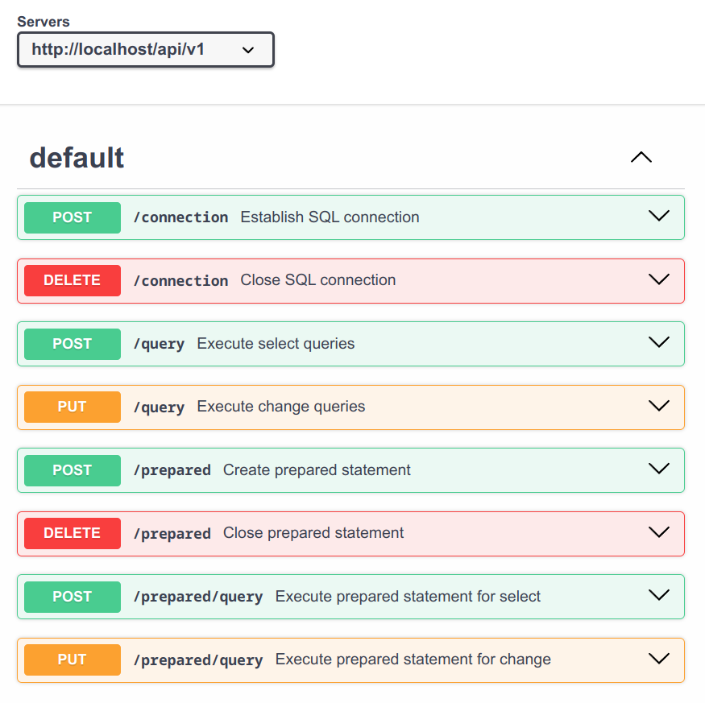

[](https://github.com/alm494/sql_proxy/blob/main/README.md)
[](https://github.com/alm494/sql_proxy/blob/main/README.ru.md)

# SQL-PROXY

## Описание

Легковесный REST-сервис, разработанный для замены вызовов ADODB в устаревших программных системах, поддерживающих веб-запросы. 
Этот сервис упрощает взаимодействие с базами данных, сохраняя при этом безопасность и эффективность. 

Например, вы можете удалить все несовместимые с Linux компоненты, такие как следующие элементы (пример для 1С:Предприятие): 
 
```
Соединение = Новый COMObject("ADODB.Connection");
Соединение.Open(СтрокаСоединения);
```
 

и вместо этого использовать веб-запросы аналогичным образом, применяя простую библиотеку для получения результатов SQL-запросов в формате JSON с переменным числом колонок, определяемых текстом SQL-запроса: 
 
```
Функция УстановитьSQLСоединение(СтрокаСоединения) Экспорт
  HTTP = Новый HTTPConnection;
  ПутьAPI = "/api/v1/connection";
  ...
```
 

Обратитесь к примеру для языка 1С:Предприятие в папке src/doc, чтобы узнать, как использовать этот API. Обратите внимание, что данный сервис не ограничен только 1С и может быть использован в других системах.

## Описание API

Текущая версия API: 1.2. См. спецификацию Swagger OpenAPI 3.0 в папке src/docs/api



## Как скомпилировать

Номер текущей версии: 1.2.1. Выполнить в командной строке:

```
make prod
```

## Как запустить

Все параметры передаются через переменные окружения, см. Makefile для детальной информации:

```
BIND_ADDR=localhost BIND_PORT=8081 MAX_ROWS=10000 LOG_LEVEL=3 sql-proxy
```
